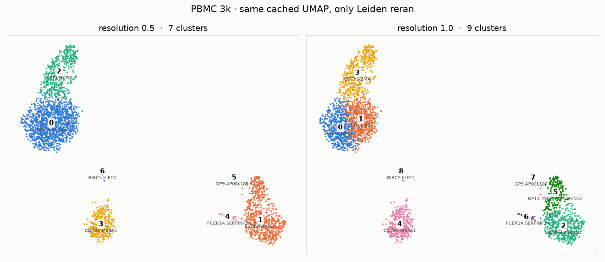

<h1 align="center">🧬 cellengine</h1>

<p align="center">
  <b>Interactive single-cell clustering.</b><br>
  Upload a count matrix, cluster it, drag the resolution slider, and see which genes define each cluster — in about a second.
</p>

<p align="center">
  <a href="https://github.com/sramireddy2/cellengine/actions/workflows/ci.yml"></a>
  
  
  
  
  
  
</p>

<p align="center">
  
</p>

---

## What this is

Single-cell RNA-seq gives you a big matrix: one row per cell, one column per gene, each number is how many copies of that gene's mRNA showed up in that cell. Cells with similar expression cluster together, and those clusters usually turn out to be cell types. Marker genes are how you tell which cluster is which.

cellengine is a small web app around that workflow. You upload a matrix, it runs the standard pipeline, draws the cells as a UMAP colored by cluster, and lists the marker genes for whatever cluster you click. The part I care about: when you drag the resolution slider it reclusters in about a second, because the expensive work is cached and only the cheap step reruns.

The demo dataset is the 10x PBMC 3k set that every tutorial uses. The clusters come out as you'd hope: T cells (`CD3D`, `IL7R`), B cells (`MS4A1`, `CD79A`), monocytes (`CD14`, `S100A8`), NK cells (`NKG7`, `GZMA`).

## 🛠️ Tech stack

| Layer | What | Why this one |
|---|---|---|
| **Science** | [scanpy](https://scanpy.readthedocs.io/), scipy, numpy, scikit-learn, umap-learn, leidenalg | The standard toolkit. Nobody reimplements Leiden; the win is knowing which step depends on which. |
| **Marker stats** | Hand-written Wilcoxon rank-sum + Benjamini-Hochberg, computed directly on the sparse matrix | The one piece I wanted to own end to end. See [the sparse trick](#the-sparse-wilcoxon-trick). |
| **API** | Django 5 + Django REST Framework, session auth | Boring, well-understood, and the ORM makes the transactional writes trivial. |
| **Database** | PostgreSQL 16 | Datasets, runs, one row per cell per run, marker tables. Unique on `(run, barcode)`. |
| **Cache + queue** | Redis 7 with [RQ](https://python-rq.org/) | One process does both jobs at this scale. RQ over Celery because I needed a queue, not a framework. |
| **Object storage** | S3 API (MinIO locally) via django-storages | Web and worker share no disk, so the worker can scale out. |
| **Frontend** | Plain HTML + one JS file, `<canvas>` scatter | No build step. Canvas because 50k SVG nodes is where browsers give up. |
| **Packaging** | One Docker image, two roles (web / worker) | One thing to build, tag, and roll back. |
| **Orchestration** | Kubernetes manifests + [KEDA](https://keda.sh/) scaling the worker on queue depth | Memory-capped worker pods so a bad upload kills a job, not the site. |
| **CI** | GitHub Actions: pytest, production settings check, image build + boot smoke test | Green badge or it didn't happen. |

## 🧠 The idea that makes it fast

```
QC → normalize → HVG → PCA → kNN graph → UMAP      cached
                                       → Leiden     reruns every time
```

Everything on the top line only depends on the data and the preprocessing settings. Leiden's resolution, the knob people actually fiddle with, comes after all of it. So I cache the graph and the UMAP in Redis under a hash of the dataset plus the preprocessing params, and a resolution change just reruns Leiden and recolors the same dots. That's why the two panels in the picture above have identical point positions. It's also a nice sanity check while you're using it: if the dots move, something's wrong.

Numbers on PBMC 3k, going through the real containerized stack, from hitting submit to the run being done:

- first run on a dataset: **~6 s**
- changing the resolution afterwards: **~1 s**

The first run in a fresh worker process is closer to 50 seconds, and almost all of that is numba compiling scanpy's kernels. So the worker is a long-lived process that warms itself up on a tiny fake matrix at boot, and users never see that cost.

Memory-wise the raw matrix is 354 MB if you make it dense and 18 MB as a sparse CSR, since it's 97% zeros. It stays sparse until PCA, which only sees the 2,000 most variable genes anyway.

## 🔬 The sparse Wilcoxon trick

To find marker genes I run a one-vs-rest Wilcoxon rank-sum test for every cluster and every gene, then correct with Benjamini-Hochberg. The obvious way is to densify each gene column and rank it. But almost every value is zero, and all the zeros in a column are one big tie with a known average rank. So I only sort the non-zeros, once, and add the zero group with a formula. All the per-cluster sums come out of `np.bincount`. Went from 6.8 s to 0.85 s with identical output, and I check it against `scipy.stats.mannwhitneyu` in the tests.

Two things I learned doing this. With 14,000 genes per cluster you can't skip multiple-testing correction, or you get hundreds of "significant" genes that are noise. And with a few hundred cells in a cluster, even a housekeeping gene that's 1.3× higher will have a p-value of 10⁻⁴⁰, so there's a fold-change floor too. Statistically significant and biologically interesting are different things.

## 🧱 How a run works

```
POST /api/datasets/          upload → object storage → worker checks it opens and records the shape
POST /api/runs/              {dataset, params} → 202 and a run id
GET  /api/runs/{id}/         poll it: queued → preprocessing → clustering → markers → done
GET  /api/runs/{id}/cells/   x, y, cluster, barcode as four arrays
GET  /api/runs/{id}/markers/?cluster=3
```

Some decisions worth mentioning:

- The web process never opens a matrix and never even imports scanpy. All the heavy stuff happens in the worker, which has a hard memory limit. If someone uploads something huge, the worker's job process gets OOM-killed and the site keeps running.
- Cell labels are committed in one transaction, marker genes in a second one. A half-written run is worse than no run. The status flips to `markers` between the two, so the scatter can draw while the stats finish.
- If the worker dies mid-run, the next poll of that run asks Redis what happened to the job and reports `failed` with the reason, instead of spinning forever. I tested this by starving the worker to 256 MB and watching a run die at the 18-second mark.
- Typos in parameter names are a 400 that tells you the key, not a silent run on defaults.

## 🐛 Things profiling taught me

I'd rather list these than pretend the first version was fast.

1. **numpy skips BLAS when dtypes are mixed.** `rankdata` on float32 input gives float32 back, and a float64 @ float32 matmul quietly takes the slow path. 150 ms → 2 ms per chunk.
2. **Thread pools fight each other.** After scanpy loads, OpenBLAS and numba both spin up threads and a 9 ms matmul became 160 ms. In a container it's worse, because BLAS sees the host's cores, not the pod's limit.
3. **GNU OpenMP isn't fork-safe.** RQ forks a child per job. With two OpenMP threads, the warmup started a thread pool in the parent and every child segfaulted inside scikit-learn's kNN. Only showed up on Kubernetes. The fix is one thread per library; scale with replicas instead. `PYTHONFAULTHANDLER=1` is what turned "signal 11" into a stack trace.
4. **Forked children re-import lazy modules.** Keeping scanpy out of the web tier meant importing it lazily in the job, which then cost 2 s per fork. Now the worker imports it once at boot and the children inherit it. Cache hits went from 3 s to 1 s.
5. **On Windows, `localhost` costs two seconds.** Python's HTTP client tries IPv6 first and Django's dev server only listens on IPv4. Benchmark against `127.0.0.1`.

## 🚀 Running it

Just the tests (sqlite, fake Redis, jobs run inline, no services needed):

```bash
python -m venv .venv && .venv/Scripts/activate      # or source .venv/bin/activate
pip install -r requirements.txt
pytest
```

Whole app with no Docker, same trick:

```bash
python scripts/fetch_pbmc3k.py
python scripts/dev_lite.py           # http://localhost:8000 · demo / demo-password-1
```

The real thing (Postgres, Redis, MinIO, web, worker):

```bash
docker compose up --build
```

Kubernetes, with the memory-capped worker and autoscaling: [deploy/README.md](deploy/README.md) has the commands and the OOM demo.

## 🗂️ Layout

```
engine/      the science: pipeline, cache serialization, sparse Wilcoxon. No Django in here.
server/      Django + DRF API, models, RQ jobs, run reconciliation, management commands
frontend/    index.html + app.js + style.css, served by Django
deploy/      k8s manifests, KEDA scaler, deploy notes (Dockerfile is at the root)
tests/       25 tests: stats vs scipy, planted markers, cache roundtrip, API end to end, orphaned runs, remote storage
```

## Why I built it

I wanted a project where the systems work was in service of something real, and where I could put a number next to every claim instead of hand-waving about scale. It's scoped on purpose: 3k–50k cells, one clustering algorithm, one demo dataset. Everything in it has been run end to end on a real cluster, and the parts I'd want to talk about are the ones above.
